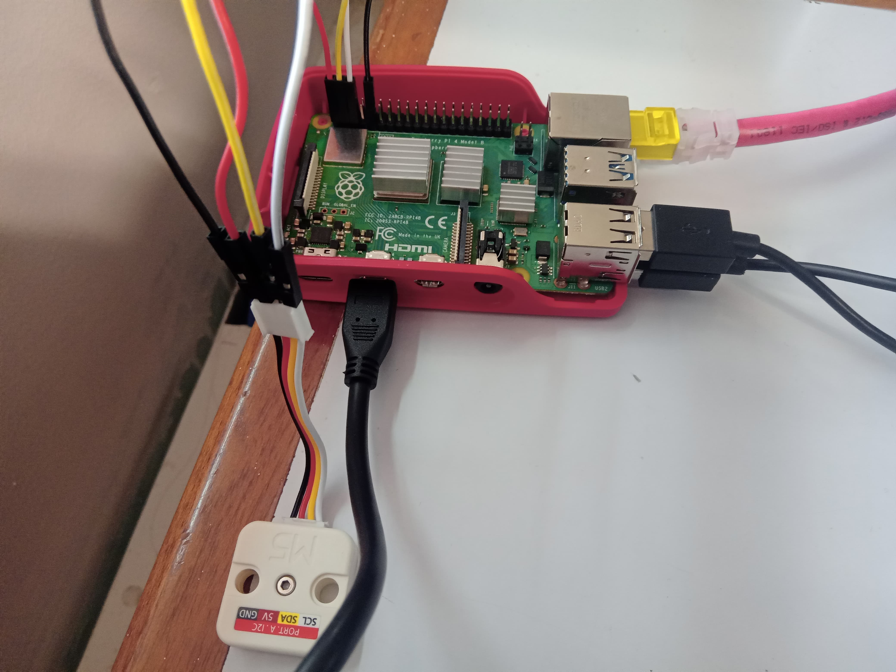
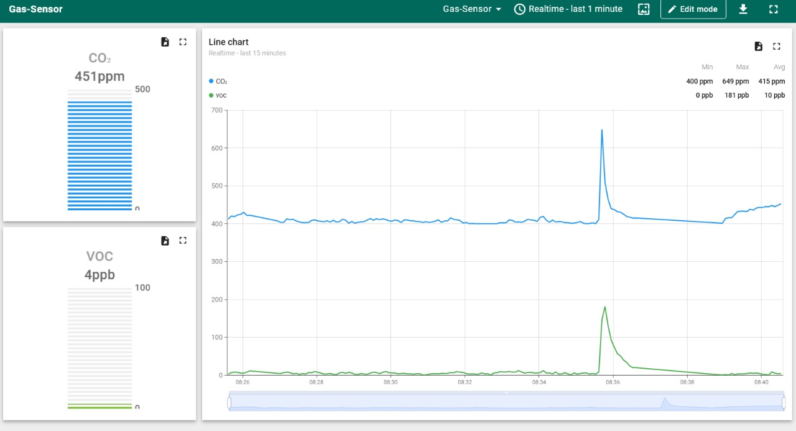
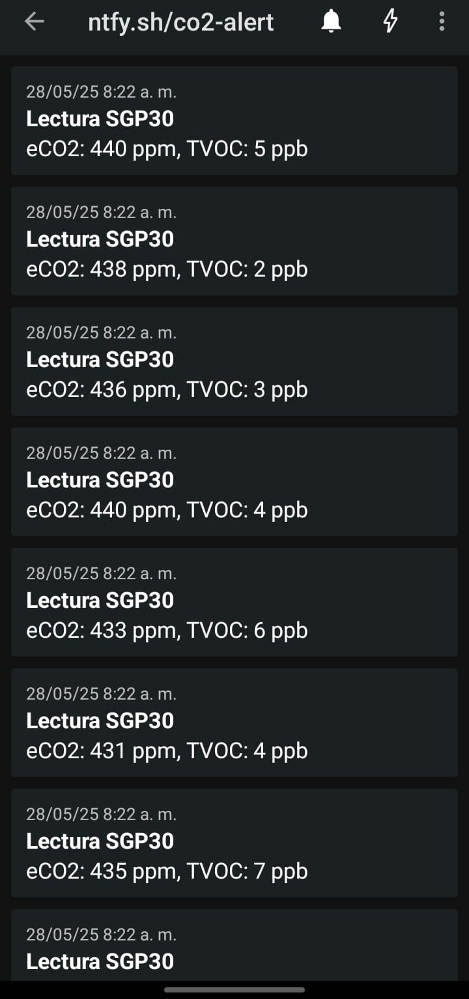
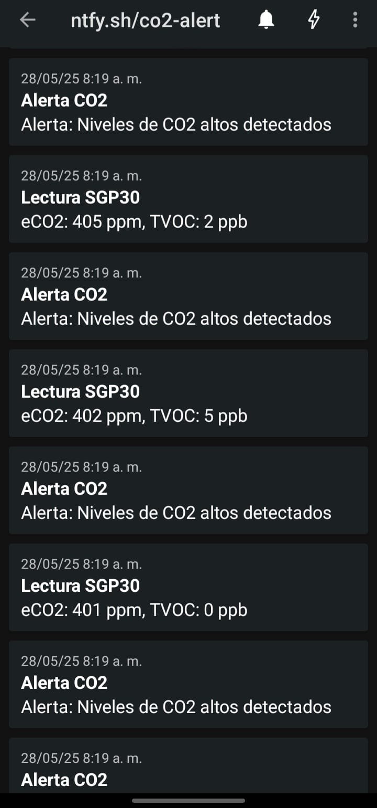

# Monitoreo Inteligente De Gases
Un sistema de monitoreo inteligente de calidad del aire que captura datos de dióxido de carbono (CO₂) y compuestos orgánicos volátiles (COV), y los retransmite en tiempo real desde una Raspberry Pi hacia una plataforma remota. 

Además, se generan alertas automáticas y notificaciones push a dispositivos móviles cuando se detectan niveles elevados.

## Autor
-     Miguel Bolaño López

## Objetivos
 - Monitorear niveles de CO₂ y VOC.
 - Visualizar datos remotamente en ThingsBoard.
 - Generar alertas ante niveles elevados.
 - Enviar notificaciones de depuración con ntfy.sh.

## Componentes
- Raspberry Pi 4
- Sensor SGP30
- ThingsBoard
- ntfy.sh (servicio de notificaciones push)

## Conexiones entre la Raspberry Pi 4 y el sensor SGP30
| SGP30        | Raspberry Pi 4                   |
|--------------|----------------------------------|
| 5v           | 3v3 power (pin 1)                |
| SDA          | GPIO2 SDA (pin 3)                |
| SCL          | GPIO2 SCL (pin 5)                |
| GND          | Ground (pin 9)                   |

## Librería
Se clonó la librería de Pi Moroni y se instalaron sus dependencias, mediante:
```
git clone https://github.com/pimoroni/sgp30-python
```

## Montaje


## Resultados
### ThingsBoard


### ntfy.sh
- Notificaciones de lectura de los gases


- Notificaciones de alertas


## Video de funcionamiento del proyecto
[](https://www.youtube.com/watch?v=MM3IGMTiQrE)

